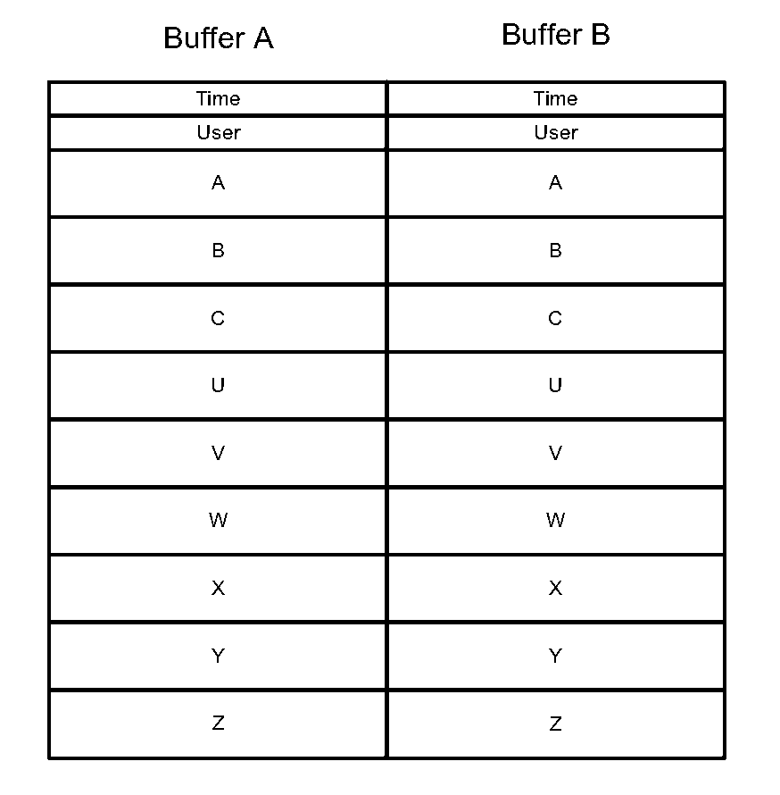
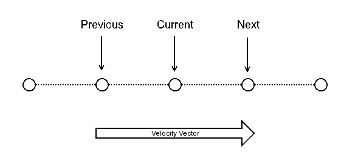

.. _trajectory_scan:

==============================
Trajectory Scan Motion Program
==============================

PMAC Requirements
-----------------

 * P-Variables - 4000..20, 4101..122 and 4131..139
 * Q-Variables - 71..79, 91..99
 * M-Variables - 4000..11, 15, 17, 4020..31, 4040..49
 * User memory - 20*BufferLength L addresses for the actual points buffers + 10 spare

.. _program_design:
Program Design
--------------

The motion program operates using two buffers, one of which can be scanned through by the PMAC while the other can be filled with points by EPICS. The idea is that a scan of any length can be sent from the data acquisition layer to the EPICS layer and can then be run continuously as if there is no limit to the PMAC memory. The buffer layout is shown in the diagram below:

The program requires buffers to be completely full; if a buffer is not full, it will scan through the buffer and then end the scan, even if the next buffer has points.

The program keeps 3 points per axis (plus time) accessible at any time; Prev\_* and Current\_* values are stored in P-Variables and Next\_* values are stored in an M variable. The M variable is used to iterate through the user memory addresses using pointers (_Adr values) to the M Variable definitions. Before each increment, the 3-point-buffers are shifted Current -> Prev and then Next -> Current. This allows the PMAC to calculate the required trajectory for each Current\_* point

Buffers are iterated through with the CurrentIndex variable, which corresponds to the Next_* coordinate in the buffer. However Current_* is the coordinate that the move command uses. This means that the main loop runs from 1 to N-1 (rather than the full 0 to N-1), because in the very first loop no move can be made until Current_* is at 0, i.e. when Next_* is at 1. This means there is an extra move after the inner while loop to move to the last point of the buffer while using the first point of the next buffer for velocity calculations. However this does not work for the last point of the last buffer, because there is no next buffer for the Next_* coordinate. For this, there is an extra move after the outer loop to move to the very last point using the Prev -> Current velocity calculation.

Subroutines
~~~~~~~~~~~~

These are descriptions of what each subroutine does:

Subroutine 101:
    Check if the values for `Axes` is valid (between 1 and 511) and then assigns AxesParser to that value. Axes parser is an M variable pointing to a Y address (root of user memory + 1). The *_Axis values point to each bit of the same Y address, so when the value is set the relevant axes are activated with a 1 value. The unused axes remain at 0. An invalid Axes value will abort the program with Error 1.

Subroutine 102 and 103:
    Shift values through the buffer. Prev_* and Current_* are P-Variables and Next_* are M variables that the addresses are changed for. For each step, Prev is set to Current and Current is set to Next (GoSub102), and then the address is updated (GoSub103). This process is split into two because GoSub103 must be run on it's own once at the start of the program to set initial values for the addresses.

Subroutines 104 - 107:
    Calculate the velocity vector (*_Vel values) for the current move. GoSub104 is a short process to check for an error and then choose which velocity calculation to use. A move time of 0 will abort the program with Error 2. GoSub105, 106 and 107 are the velocity calculations for Prev->Current (VelMode = 1), Prev->Next (VelMode = 0 or VelMode > 2) and Current->Next (VelMode = 2).

Subroutine 108:
    Set the Current_* and *_Vel values to Q_Variables and then command the move and increment TotalPoints.

User Subroutines 1 and 2:
    Set Trigger (M32) high and low, respectively.

Dynamic Velocity Calculation
~~~~~~~~~~~~~~~~~~~~~~~~~~~~

The motion program implements a dynamic velocity calculation to allow more generic trajectory scans to be demanded from higher level software. By default (0) the velocity will be calculated using the three currently stored coordinates, i.e. the previous->next vector:

If VelMode is set to 1 it will calculate the previous->current vector:

If VelMode is set to 2 it will calculate the current->next vector:

This allows the user to set exit and entrance velocity vectors from an area of interest and the PMAC will interpolate the smoothest curve, given the time allowed time for the move, between the points. The user then doesn't have to worry about adding points to ensure smooth turnarounds.

.. _epics_api:
Epics API
---------

There are various P-Variables in the motion program that are relevant to EPICS, these are:

Read Variables
~~~~~~~~~~~~~~

    * Status (P4001) - The current state of the motion program i.e. 0: Initialised, 1: Active, 2: Idle, 3: Error
    * BufferLength (P4004) - The length of a single buffer e.g. len(AX)
    * TotalPoints (P4005) - The total number of points that the PMAC has scanned through
    * CurrentIndex (P4006) - The current point in the buffer
    * CurrentBuffer (P4007) - The specifier for the current half-buffer i.e. 0: Buffer A, 1: Buffer B
    * BufferAdr_A/BufferAdr_B (P4008/9) - The starting address in the PMAC user memory for buffer A/B
    * Error (P40015) - Error code corresponding to Status = 3; 0: No error, 1: Invalid axes value, 2: Move time of 0, 3: Following error/ Run-time error

Write Variables
~~~~~~~~~~~~~~~

    * Abort (P4002) - A trigger to abort the scan (will move to current target point)
    * Axes (P4003) - A bit mask to specify which axes are to be used in the scan. A = 1, B = 2, ..., Z = 256 e.g. for axes U, V, X and Y the value would be 8 + 16 + 64 + 128 = 216
    * BufferFill_A/BufferFill_B (P4011/12) - The number of points written into buffer A/B

Buffer Filling
~~~~~~~~~~~~~~

EPICS must write the position coordinates as 48-bit PMAC floats (with a write L command). These are a custom delta tau format and must be written in hex. PmacTestHarness and the EPICS driver both have a converter function for this. The time coordinates, user and velocity mode values must be written into a single address (also with a write L) in the following format:

Time will then be read from the Y memory and User & VelMode will be read from the appropriate bits in the X memory. Time is the integer number of 1/4s of a milliseconds for the move (this must be written in hex), VelMode is 0, 1 or 2 as described in :ref:`program_design` and User is the number of the subroutine that should be run at the point.

